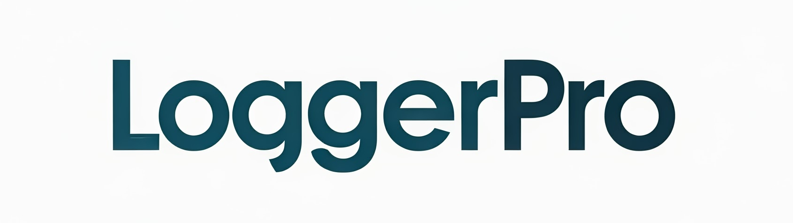

# LoggerPro for Delphi

  

<h3 align="center">The Modern, Async, Pluggable Logging Framework for Delphi</h3>

  
  
  
  

---

<h2 align="center">
  📖 The official guide — install, API reference, tutorials, code samples, FAQ:  
  <a href="https://www.danieleteti.it/loggerpro/">https://www.danieleteti.it/loggerpro/</a>
</h2>

  Available in
  <a href="https://www.danieleteti.it/loggerpro/">🇬🇧 English</a> ·
  <a href="https://www.danieleteti.it/loggerpro-it/">🇮🇹 Italiano</a> ·
  <a href="https://www.danieleteti.it/loggerpro-es/">🇪🇸 Español</a> ·
  <a href="https://www.danieleteti.it/loggerpro-de/">🇩🇪 Deutsch</a>

---

## What is LoggerPro

Async, pluggable, production-proven logging framework for Delphi. Used in
thousands of applications worldwide since 2010.

- **Async by design** - non-blocking, zero impact on your app's hot path
- **20+ built-in appenders** - File, Console, HTTP, ExeWatch cloud observability, Grafana Loki via LogFmt, ElasticSearch, UDP Syslog, Windows Event Log, Database, ...
- **Fluent Builder API** - Serilog-style configuration
- **JSON configuration** - reshape the logger at deploy time without rebuilding
- **Structured logging** - first-class `LogParam` context
- **Cross-platform** - Windows, Linux, macOS, Android, iOS
- **Thread-safe**, **DLL-safe**, Apache 2.0

## What's New in 2.1

- 🆕 **JSON configuration** - reshape your logger at deploy time without rebuilding
- 🆕 **HTML live log viewer** - self-contained `.html` with filters, search, export, live tailing
- 🆕 **ExeWatch integration** - first-class cloud observability via [ExeWatch](https://exewatch.com)
- 🆕 **Pluggable appenders** - optional backends self-register, just add the `uses` clause
- 🆕 **LogFmt renderer** - spec-compliant `key=value` output for Loki, humanlog, ripgrep
- 🆕 **FileBySource appender** - per-tenant subfolders with day+size rotation
- 🆕 **Runtime log level** - change the global gate on the fly via `ILogWriter.MinimumLevel`
- 🆕 **UTF-8 console output** - correct Unicode in Docker and Windows consoles
- 🆕 **DLL-safe init** - fixes the Windows Loader Lock deadlock
- 🆕 **ElasticSearch auth** - Basic / API Key / Bearer Token
- 🆕 **UDP Syslog local time** option
- 🆕 **`GetCurrentLogFileName` API** on file appenders

---

## 👉 Everything else — install, full API, every code sample, LogFmt querying, Docker/DLL guidance, Windows Service integration, JSON config schema, FAQ — lives in the official guide:

## [www.danieleteti.it/loggerpro](https://www.danieleteti.it/loggerpro/)

---

## License

Apache License 2.0 - free for personal and commercial use.

## Author

**Daniele Teti**

- Blog & docs: [danieleteti.it](https://www.danieleteti.it) · [danieleteti.it/loggerpro](https://www.danieleteti.it/loggerpro/)
- Twitter/X: [@danieleteti](https://twitter.com/danieleteti)

---

  <b>LoggerPro - Professional Logging for Professional Delphi Developers</b> 
  <a href="https://www.danieleteti.it/loggerpro/">📖 Full documentation →</a>

